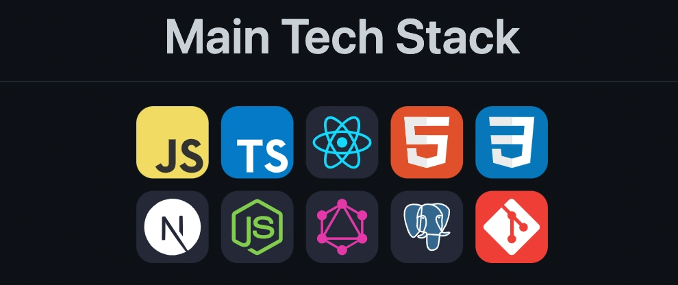

  <!-- Banner: the tool will transform this local path to a URL when you upload. -->
  

  <!-- Visitor Counter -->
  

  <!-- LinkedIn Button (Minimal Dark) -->
  

  <!-- Gmail Button (Minimal Dark) -->
  

<h3 align="center">👋 Hi — I'm Raju Patil</h3>

Full-stack developer • building fast, maintainable web apps • Tech: JavaScript, React, Node.js, Java

---

## Skills 👨‍💻

| Category | Skills |
|----------|--------|
| **Frameworks** |     
| **Languages** |      |
| **Styling & Frameworks** |     |
| **Database** |   |
| **Services & Tools** |    |
| **Competitive Coding** |  |
| **IDE & Environment** |   |
| **Hosting** |      |
| **APIs** |   |

---

## 🔭 What I’m working on
- Building a production-ready React + Node.js app (auth, REST/GraphQL, CI/CD).
- Improving system design and performance tuning.

## Contribution Activity

  

  

  

